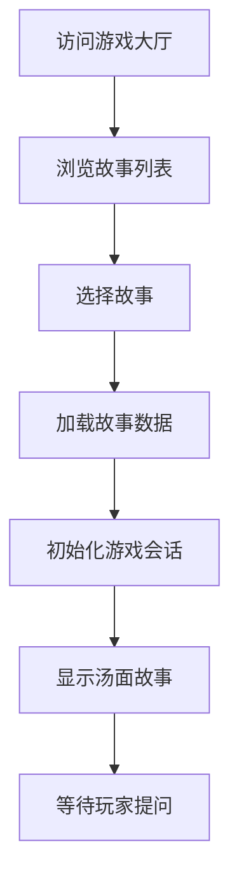
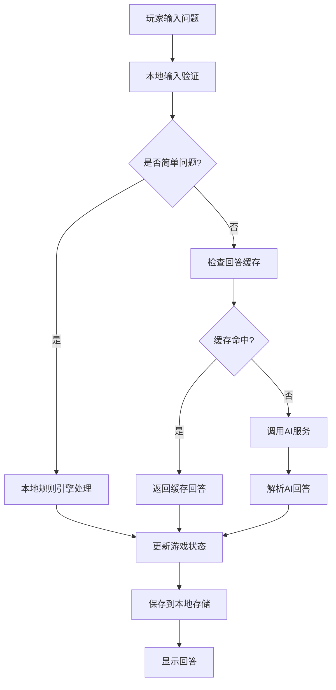
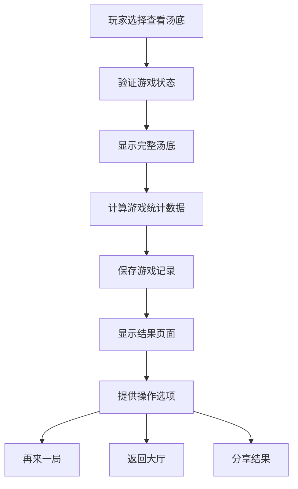
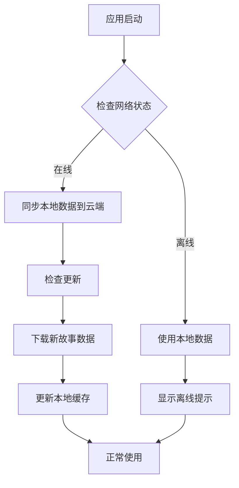

# AI海龟汤游戏技术设计 (优化版)

*基于目标：偶尔玩家、免费、Web-only的优化设计*

## 项目概述

### 设计目标
1. **简化架构**：针对偶尔玩家，简化技术栈，降低维护成本
2. **免费友好**：无广告，最小化运营成本，优化AI使用成本
3. **Web优先**：纯Web应用，支持PWA，离线可用
4. **安全第一**：保护用户数据，防止AI提示泄露游戏解决方案

### 核心原则
- **离线优先**：核心功能支持离线使用
- **渐进增强**：基础功能广泛兼容，高级功能现代浏览器
- **成本控制**：最小化AI API调用，本地规则引擎优先
- **用户体验**：简单直观，适合偶尔玩家快速上手

## 技术栈

### 前端架构
- **框架**: React 18 + TypeScript + Vite
- **样式**: Tailwind CSS + shadcn/ui (组件库)
- **状态管理**: Zustand (轻量级，性能优于Context)
- **路由**: React Router (App Router风格)
- **存储**: IndexedDB (本地) + LocalStorage (简单数据)
- **PWA支持**: Service Workers (可选，增强离线体验)

### 后端策略
- **MVP阶段**: 纯前端实现，本地故事数据 + 规则引擎AI
- **阶段2**: Vercel Edge Functions 处理AI调用 (无服务器)
- **云服务**: Supabase免费层 (用户数据同步、认证)
- **避免**: 完整的Node.js后端服务器 (降低复杂度)

### 部署架构
- **前端**: Vercel (全球CDN，自动HTTPS)
- **AI服务**: Vercel Edge Functions 或 Supabase Functions
- **数据库**: Supabase PostgreSQL (免费层)
- **监控**: Sentry (错误监控) + Vercel Analytics

### 开发工具
- **构建**: Vite + TypeScript
- **代码质量**: ESLint + Prettier + TypeScript严格模式
- **测试**: Vitest + React Testing Library
- **包管理**: npm 或 pnpm

## 项目结构

```
ai-turtle-soup-game/
├── src/
│   ├── app/                    # App Router页面
│   │   ├── layout.tsx         # 根布局
│   │   ├── page.tsx           # 首页/游戏大厅
│   │   ├── game/[id]/         # 游戏页面 (动态路由)
│   │   │   ├── page.tsx       # 游戏主界面
│   │   │   └── loading.tsx    # 加载状态
│   │   └── result/[id]/       # 结果页面
│   │       ├── page.tsx       # 结果展示
│   │       └── actions.ts     # 服务端动作
│   ├── components/
│   │   ├── ui/                # 基础UI组件 (shadcn/ui)
│   │   │   ├── button.tsx
│   │   │   ├── card.tsx
│   │   │   ├── dialog.tsx
│   │   │   └── input.tsx
│   │   ├── game/              # 游戏相关组件
│   │   │   ├── GameCard.tsx   # 游戏卡片
│   │   │   ├── ChatInterface.tsx # 聊天界面
│   │   │   ├── MessageBubble.tsx # 消息气泡
│   │   │   ├── StoryDisplay.tsx # 故事展示
│   │   │   └── HintSystem.tsx # 提示系统
│   │   └── layout/            # 布局组件
│   │       ├── Header.tsx
│   │       ├── Footer.tsx
│   │       └── Navigation.tsx
│   ├── lib/                   # 业务逻辑库
│   │   ├── ai/                # AI相关
│   │   │   ├── client.ts      # AI API客户端
│   │   │   ├── prompt.ts      # 安全提示模板
│   │   │   ├── rule-engine.ts # 本地规则引擎
│   │   │   └── cache.ts       # AI回答缓存
│   │   ├── storage/           # 存储管理
│   │   │   ├── local.ts       # IndexedDB包装器
│   │   │   ├── sync.ts        # 云同步管理器
│   │   │   └── migration.ts   # 数据迁移
│   │   ├── game/              # 游戏逻辑
│   │   │   ├── engine.ts      # 游戏状态机
│   │   │   ├── validation.ts  # 输入验证
│   │   │   └── scoring.ts     # 计分系统
│   │   └── utils/             # 工具函数
│   │       ├── constants.ts   # 常量
│   │       ├── helpers.ts     # 辅助函数
│   │       └── logger.ts      # 日志工具
│   ├── types/                 # TypeScript类型定义
│   │   ├── game.ts           # 游戏相关类型
│   │   ├── user.ts           # 用户相关类型
│   │   ├── ai.ts             # AI相关类型
│   │   └── storage.ts        # 存储相关类型
│   ├── data/                  # 静态数据
│   │   ├── stories.json      # 预加载故事 (加密存储汤底)
│   │   ├── categories.json   # 分类数据
│   │   └── seed.ts           # 数据种子脚本
│   ├── stores/               # Zustand状态存储
│   │   ├── game.store.ts     # 游戏状态
│   │   ├── ui.store.ts       # UI状态
│   │   └── user.store.ts     # 用户状态
│   └── public/               # 静态资源
│       ├── images/
│       ├── fonts/
│       └── manifest.json     # PWA清单
├── docs/                     # 文档
├── public/                   # 公共资源
└── 配置文件
    ├── package.json
    ├── tsconfig.json
    ├── vite.config.ts
    ├── tailwind.config.js
    ├── eslint.config.js
    └── vercel.json          # 部署配置
```

## 数据模型

### Story (海龟汤故事 - 完整元数据)
```typescript
interface Story {
  id: string;
  title: string;
  surface: string;           // 汤面 (故事开头)
  bottom: string;           // 汤底 (解决方案，客户端加密存储)
  difficulty: 'easy' | 'medium' | 'hard';
  category: string;         // 分类: 'mystery', 'scifi', 'everyday', 'historical'
  tags: string[];           // 标签
  estimatedTime: number;    // 预估完成时间 (分钟)
  hints: string[];          // 渐进式提示数组
  author?: 'ai' | 'user' | 'curated'; // 故事来源
  rating?: number;          // 用户评分 1-5
  playCount: number;        // 游玩次数
  winRate?: number;         // 通关率 (0-1)
  createdAt: number;        // 创建时间戳
  updatedAt: number;        // 更新时间戳
  locale: 'zh-CN' | 'en-US'; // 语言
  version: number;          // 故事版本 (用于更新)
}
```

### GameSession (游戏会话 - 完整跟踪)
```typescript
interface GameSession {
  id: string;
  storyId: string;
  status: 'active' | 'completed' | 'abandoned' | 'paused';
  startTime: number;
  endTime?: number;
  questions: QuestionAnswer[]; // 问题-回答对
  hintsUsed: number;          // 使用提示次数
  solutionRevealed: boolean;  // 是否查看了汤底
  solved: boolean;            // 是否成功解决
  score?: number;             // 游戏得分
  localSaveId?: string;       // IndexedDB存储ID
  cloudSyncId?: string;       // 云同步ID (如果已同步)
  deviceInfo?: {             // 设备信息 (用于分析)
    userAgent: string;
    platform: string;
  };
}
```

### QuestionAnswer (问题回答对)
```typescript
interface QuestionAnswer {
  id: string;
  question: string;
  answer: 'yes' | 'no' | 'irrelevant' | 'partial' | 'pending' | 'error';
  timestamp: number;
  processingTime?: number;    // AI处理时间 (ms)
  confidence?: number;        // AI置信度 (0-1)
  source: 'ai' | 'rule-engine' | 'cache'; // 回答来源
  cached?: boolean;           // 是否来自缓存
}
```

### UserPreferences (用户偏好 - 本地存储)
```typescript
interface UserPreferences {
  theme: 'light' | 'dark' | 'auto';
  language: string;
  soundEnabled: boolean;
  hintsEnabled: boolean;     // 是否启用提示系统
  autoSave: boolean;         // 自动保存游戏进度
  difficultyPreference: 'easy' | 'medium' | 'hard' | 'adaptive';
  reduceAnimations: boolean; // 减少动画
  fontSize: 'small' | 'medium' | 'large';
  dataSaver: boolean;        // 数据节省模式 (减少AI调用)
}
```

## 核心流程

### 1. 游戏初始化流程


### 2. 提问回答流程


### 3. 游戏结束流程


### 4. 离线/在线同步流程


## AI集成设计

### 安全架构
#### 问题：避免解决方案泄露
1. **不发送完整汤底**：使用故事ID + 服务端映射
2. **汤底哈希验证**：客户端计算SHA-256哈希，服务端验证
3. **上下文限制**：只发送必要信息，不暴露完整故事细节
4. **回答类型限制**：严格限制AI输出格式

#### 安全Prompt模板
```typescript
// 安全Prompt模板 - 不暴露汤底
const SAFE_PROMPT_TEMPLATE = `
你是一个海龟汤游戏的主持人，只能回答"是"、"否"、"部分相关"或"无关"。

游戏规则：
1. 玩家会提出关于故事真相的问题
2. 你只能根据故事真相回答
3. 不要透露任何故事细节
4. 不要解释你的推理过程
5. 只输出一个词：是、否、部分相关、或无关

故事信息：
- 故事主题：{theme}
- 难度级别：{difficulty}
- 故事开头：{surface}

已确认事实（从之前问答）：
{confirmedFacts}

需要避免的线索：
{avoidClues}

当前问题：{question}

请回答（仅一个词）：
`;
```

### 本地规则引擎 (离线后备)
```typescript
class RuleEngine {
  private keywordPatterns = {
    yes: ['是', '死亡', '谋杀', '自杀', '凶手', '受害者'],
    no: ['否', '活着', '安全', '无辜', '意外'],
    partial: ['可能', '或许', '部分', '有关联'],
    irrelevant: ['颜色', '天气', '无关', '不知道']
  };

  evaluate(question: string, context: GameContext): AnswerType {
    // 基于关键词的简单规则匹配
    const lowerQuestion = question.toLowerCase();

    for (const [type, keywords] of Object.entries(this.keywordPatterns)) {
      if (keywords.some(keyword => lowerQuestion.includes(keyword))) {
        return type as AnswerType;
      }
    }

    return 'irrelevant'; // 默认回答
  }
}
```

### AI服务客户端
```typescript
class AIService {
  private cache = new Map<string, AnswerType>();
  private ruleEngine = new RuleEngine();

  async getAnswer(
    question: string,
    storyId: string,
    context: GameContext
  ): Promise<AnswerType> {

    // 1. 检查缓存
    const cacheKey = `${storyId}:${question}`;
    if (this.cache.has(cacheKey)) {
      return this.cache.get(cacheKey)!;
    }

    // 2. 本地规则引擎处理简单问题
    const ruleAnswer = this.ruleEngine.evaluate(question, context);
    if (ruleAnswer !== 'irrelevant') {
      this.cache.set(cacheKey, ruleAnswer);
      return ruleAnswer;
    }

    // 3. 调用AI API (在线时)
    if (navigator.onLine) {
      try {
        const aiAnswer = await this.callAIAPI(question, storyId, context);
        this.cache.set(cacheKey, aiAnswer);
        return aiAnswer;
      } catch (error) {
        console.warn('AI API调用失败，使用规则引擎后备:', error);
        return 'irrelevant';
      }
    }

    // 4. 离线默认回答
    return 'irrelevant';
  }
}
```

## 存储策略

### 本地存储 (IndexedDB)
```typescript
// IndexedDB数据库设计
const DB_SCHEMA = {
  name: 'TurtleSoupGames',
  version: 1,
  stores: {
    sessions: {
      keyPath: 'id',
      indexes: [
        { name: 'storyId', keyPath: 'storyId' },
        { name: 'status', keyPath: 'status' },
        { name: 'startTime', keyPath: 'startTime' }
      ]
    },
    stories: {
      keyPath: 'id',
      indexes: [
        { name: 'difficulty', keyPath: 'difficulty' },
        { name: 'category', keyPath: 'category' },
        { name: 'tags', keyPath: 'tags', multiEntry: true }
      ]
    },
    preferences: {
      keyPath: 'id'
    },
    cache: {
      keyPath: 'key'
    }
  }
};
```

### 云同步策略
- **离线优先**：所有操作先保存到本地，在线时同步
- **冲突解决**：最后写入胜利 (LWW) 或用户选择
- **增量同步**：只同步变更数据，减少带宽使用
- **数据加密**：敏感数据客户端加密后再同步

## 性能优化

### 1. 加载性能
- **代码分割**：路由级和组件级代码分割
- **预加载**：预测用户下一步操作，预加载资源
- **资源优化**：图片压缩，字体子集，资源懒加载
- **缓存策略**：静态资源长期缓存，API响应适当缓存

### 2. 运行时性能
- **状态管理优化**：Zustand选择器避免不必要的重渲染
- **虚拟列表**：长列表使用虚拟滚动
- **防抖节流**：用户输入和滚动事件优化
- **Web Worker**：复杂计算移出主线程

### 3. AI性能优化
- **多层缓存**：内存缓存 + IndexedDB缓存 + 预计算
- **批量请求**：合并多个AI请求（如果支持）
- **请求优先级**：用户当前问题优先，背景任务延迟
- **回答预测**：预计算常见问题答案

## 安全考虑

### 数据安全
1. **客户端加密**：故事汤底客户端加密存储
2. **传输安全**：所有API调用使用HTTPS
3. **输入验证**：用户输入服务器和客户端双重验证
4. **XSS防护**：React自动转义，内容安全策略(CSP)

### AI安全
1. **提示注入防护**：清理用户输入，防止提示注入
2. **输出过滤**：验证AI回答格式，防止恶意内容
3. **使用限制**：API调用频率限制，防止滥用
4. **审计日志**：记录所有AI请求，便于审计

### 用户隐私
1. **匿名游玩**：支持完全匿名，不收集个人信息
2. **数据最小化**：只收集必要数据
3. **用户控制**：数据导出、删除功能
4. **透明政策**：清晰隐私政策，说明数据使用

## 部署架构

### 开发环境
- **本地开发**：Vite开发服务器 + 热重载
- **API模拟**：Mock Service Worker (MSW) 模拟API
- **测试环境**：Vitest + React Testing Library

### 生产环境
```
用户浏览器
    ↓
[Cloudflare CDN]  # 静态资源加速
    ↓
[Vercel Edge]     # 前端应用 + Edge Functions
    ↓
[Supabase]        # 数据库 + 认证 + 实时同步
    ↓
[DeepSeek API]    # AI服务 (通过Vercel Edge代理)
```

### 部署步骤
1. **前端部署**：`vercel --prod` 自动部署到Vercel
2. **数据库设置**：Supabase控制台初始化数据库
3. **环境变量**：设置API密钥和配置
4. **域名配置**：自定义域名 + SSL证书
5. **监控设置**：Sentry错误监控 + Vercel Analytics

## 监控与维护

### 监控指标
1. **性能监控**：页面加载时间，AI响应时间，错误率
2. **业务监控**：活跃用户，游戏完成率，用户留存
3. **成本监控**：AI API调用量，云服务费用
4. **错误监控**：前端错误，API错误，AI服务错误

### 维护计划
1. **定期更新**：依赖包更新，安全补丁
2. **备份策略**：数据库定期备份，恢复测试
3. **容量规划**：监控资源使用，提前扩容
4. **用户支持**：反馈收集，问题跟踪，版本发布

## 扩展路线图

### 阶段1: MVP (4周)
- 基础游戏功能，本地故事，规则引擎AI
- 响应式设计，基础UI，离线支持

### 阶段2: 增强 (4周)
- AI集成，云同步，用户系统
- 高级功能：提示系统，统计，社交分享

### 阶段3: 扩展 (6周)
- AI故事生成，用户创作，社区功能
- 多语言支持，高级分析，移动端优化

### 阶段4: 优化 (持续)
- 性能优化，用户体验改进，新功能开发
- 规模扩展，国际化，生态系统建设